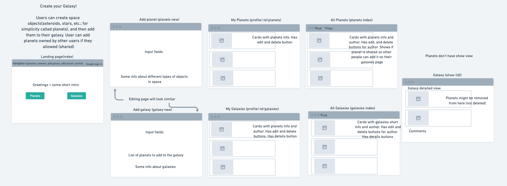

# Create your Galaxy!

Question: how many Galaxies are there in our Universe? The answers vary, but an acceptable range is between 100 billion and 200 billion galaxies. 
Another question: do you think that's enough? Well, if you don't, you are in the right place! In "Create your Galaxy!" you can build not 1, not 2, and not even 3, but as many Galaxies as you want, brand new. And then fill them up with different Space Objects(things like planets, stars, etc.) also created by you or other people. So hop in, if you are ready. The Universe awaits!

## Getting Started

Try it now: <https://create-your-galaxy.herokuapp.com/>

## Screenshots

##### Initial wireframe

##### "Create your Galaxy!" now

##### Trello project link

<https://trello.com/b/CFM4maQJ/demiurge-create-your-own-galaxy>

## Technologies used

+ HTML
+ JavaScript (EJS)
+ CSS
+ Node.js with Express.js
+ MongoDB with Mongoose.js

## Planned future enhancements

+ Graphic enhancements
+ Improve responsive design
+ Enhance features of Space Objects and Galaxies
+ Implement find, sort and filter functionalities
+ Add interesting astronomical facts
